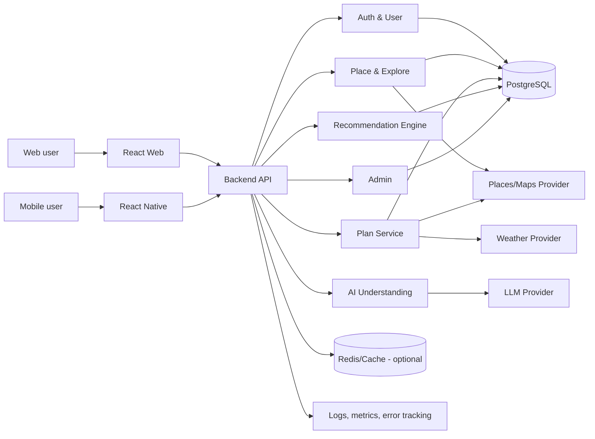
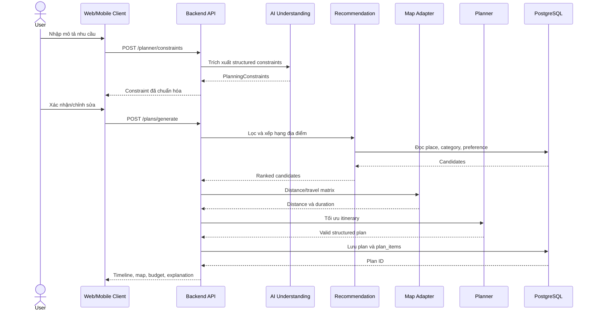
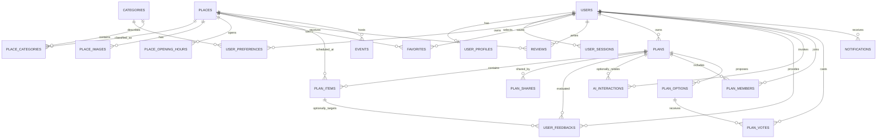

# Wanderly — Phân tích, thiết kế hệ thống và cơ sở dữ liệu

## 1. Tổng quan

Wanderly là hệ thống gợi ý địa điểm và lập lịch trình vui chơi cá nhân hóa. Người dùng mô tả nhu cầu bằng ngôn ngữ tự nhiên; hệ thống trích xuất các ràng buộc, tìm địa điểm có thật, xếp hạng, xây dựng lịch trình và kiểm tra tính khả thi theo thời gian, ngân sách, khoảng cách, giờ mở cửa và thời tiết.

Mục tiêu khác biệt của Wanderly không phải trả về danh sách địa điểm, mà tạo ra một **kế hoạch có thể thực hiện ngay**.

Tên đề tài:

> Wanderly – Xây dựng hệ thống gợi ý địa điểm và lập kế hoạch vui chơi thông minh ứng dụng trí tuệ nhân tạo.

## 2. Phạm vi hệ thống

### 2.1 Phạm vi MVP

- Đăng ký, đăng nhập và quản lý hồ sơ.
- Khai báo sở thích người dùng.
- Khám phá, tìm kiếm và lọc địa điểm.
- Xem chi tiết, lưu yêu thích và đánh giá địa điểm.
- Nhập yêu cầu lập lịch trình bằng ngôn ngữ tự nhiên.
- Xác nhận/chỉnh sửa constraint trước khi tạo lịch trình.
- Xếp hạng địa điểm phù hợp.
- Tạo itinerary có cấu trúc.
- Kiểm tra ngân sách, giờ mở cửa, thời gian di chuyển và thời tiết.
- Hiển thị timeline, bản đồ, tuyến đường và chi phí.
- Thay thế một địa điểm và tính lại phần lịch trình liên quan.
- Lưu, chỉnh sửa và chia sẻ lịch trình.
- Admin quản lý người dùng, địa điểm, danh mục, sự kiện và review.

### 2.2 Ngoài phạm vi MVP

- Group Planning và voting.
- Surprise Me.
- AI chat chỉnh sửa lịch trình.
- Notification tự động.
- Học sở thích nâng cao bằng machine learning.
- Thanh toán hoặc đặt chỗ trực tiếp.

Thiết kế dữ liệu vẫn dự phòng cho các chức năng mở rộng trên.

## 3. Tác nhân

| Tác nhân             | Mô tả                    | Quyền chính                                             |
| -------------------- | ------------------------ | ------------------------------------------------------- |
| Guest                | Người chưa đăng nhập     | Xem Explore, Place Detail và plan được chia sẻ          |
| User                 | Người dùng đã đăng nhập  | Quản lý hồ sơ, tạo/lưu/sửa plan, favorite, review       |
| Group member         | User tham gia group plan | Chọn sở thích, xem phương án và vote                    |
| Admin                | Người quản trị           | Quản lý dữ liệu, người dùng, review, event và dashboard |
| LLM provider         | Dịch vụ AI bên ngoài     | Trích xuất constraint và tạo giải thích                 |
| Maps/Places provider | Dịch vụ bản đồ           | Dữ liệu địa điểm, geocoding, khoảng cách và route       |
| Weather provider     | Dịch vụ thời tiết        | Dự báo theo tọa độ và thời gian                         |

## 4. Yêu cầu chức năng

### FR-01 — Tài khoản

- Người dùng đăng ký, đăng nhập, đăng xuất và làm mới session.
- Người dùng xem và cập nhật hồ sơ.
- Hệ thống phân biệt quyền `USER` và `ADMIN`.
- Người dùng chỉ được thay đổi tài nguyên thuộc quyền sở hữu của mình.

### FR-02 — Sở thích

- Người dùng chọn nhiều danh mục sở thích.
- Mỗi sở thích có trọng số từ `0` đến `1`.
- Hệ thống có thể cập nhật trọng số từ feedback trong giai đoạn mở rộng.

### FR-03 — Địa điểm

- Tìm kiếm theo từ khóa và lọc theo danh mục, giá, rating, khoảng cách.
- Hiển thị thông tin, ảnh, giờ mở cửa, vị trí và đặc điểm phù hợp.
- Mỗi địa điểm phải có nguồn dữ liệu xác định; AI không được tạo địa điểm mới.

### FR-04 — AI Understanding

- Nhận câu mô tả tự nhiên bằng tiếng Việt hoặc tiếng Anh.
- Trích xuất ngày, giờ bắt đầu/kết thúc, số người, ngân sách, vị trí, bán kính, sở thích và yêu cầu loại trừ.
- Kết quả phải tuân theo JSON schema.
- Người dùng được xác nhận/chỉnh sửa constraint trước khi lập plan.

### FR-05 — Recommendation

- Lọc địa điểm theo ràng buộc cứng.
- Xếp hạng theo sở thích, khoảng cách, rating, budget, giờ mở cửa, thời tiết và mức phổ biến.
- Trả về match score và lý do đề xuất dựa trên dữ liệu.

### FR-06 — Smart Itinerary

- Tạo các `plan_items` có thứ tự, thời gian bắt đầu/kết thúc và chi phí.
- Tính thời gian/quãng đường di chuyển giữa hai điểm liên tiếp.
- Không sắp địa điểm ngoài giờ mở cửa.
- Không vượt quá khoảng thời gian người dùng cung cấp.
- Ưu tiên không vượt ngân sách; nếu không thể, phải báo rõ constraint cần nới.

### FR-07 — Weather và budget

- Lấy dự báo phù hợp với tọa độ và thời gian của từng hoạt động.
- Cảnh báo hoạt động ngoài trời khi thời tiết xấu.
- Hiển thị chi phí từng hoạt động, di chuyển, tổng dự kiến và số dư.

### FR-08 — Smart Replace

- Người dùng chọn một plan item cần thay thế.
- Hệ thống tìm candidate phù hợp với slot hiện tại.
- Sau khi chọn, hệ thống tính lại route, thời gian, chi phí và tính hợp lệ.
- Không thay đổi các phần khác nếu không cần thiết.

### FR-09 — Tương tác và quản trị

- User có thể favorite, review, lưu và chia sẻ plan.
- Admin có thể CRUD địa điểm, danh mục, event và kiểm duyệt review.
- Các thay đổi quan trọng của admin được ghi audit log.

## 5. Yêu cầu phi chức năng

| Mã     | Nhóm        | Yêu cầu                                                         |
| ------ | ----------- | --------------------------------------------------------------- |
| NFR-01 | Hiệu năng   | API thông thường P95 dưới 500 ms, không tính external provider  |
| NFR-02 | AI latency  | Tạo itinerary P95 mục tiêu dưới 10 giây                         |
| NFR-03 | Tính đúng   | 100% plan trong test set không vi phạm constraint cứng          |
| NFR-04 | Sẵn sàng    | Provider lỗi phải có timeout, retry giới hạn và fallback        |
| NFR-05 | Bảo mật     | Mật khẩu băm; token/secret không lưu plaintext trong log        |
| NFR-06 | Riêng tư    | Chỉ thu thập dữ liệu cần thiết; cho phép xóa tài khoản          |
| NFR-07 | Mở rộng     | External provider được bọc bằng adapter                         |
| NFR-08 | Quan sát    | Có request ID, structured log, metric latency/error/quota       |
| NFR-09 | Đa nền tảng | Các luồng P0 hoạt động trên Web React và Mobile React Native    |
| NFR-10 | Khả chuyển  | Hệ thống chạy bằng container trên môi trường staging/production |

## 6. Quy tắc nghiệp vụ

| Mã    | Quy tắc                                                                   |
| ----- | ------------------------------------------------------------------------- |
| BR-01 | `start_time < end_time` đối với plan và plan item                         |
| BR-02 | `people_count >= 1`; budget và chi phí không âm                           |
| BR-03 | Plan item phải nằm trong khoảng thời gian của plan                        |
| BR-04 | Hai plan item không được chồng thời gian trong cùng plan                  |
| BR-05 | `order_index` là duy nhất trong một plan                                  |
| BR-06 | Place của plan item phải tồn tại và đang hoạt động tại thời điểm tạo plan |
| BR-07 | Thời gian đến/rời địa điểm phải phù hợp giờ mở cửa áp dụng cho ngày đó    |
| BR-08 | Mọi địa điểm do AI sử dụng phải thuộc candidate list do backend cấp       |
| BR-09 | Match score và preference weight nằm trong khoảng `0..1`                  |
| BR-10 | Một user chỉ favorite một place một lần                                   |
| BR-11 | Một user chỉ vote một lần cho mỗi nhóm/phương án                          |
| BR-12 | Public share token phải khó đoán, có thể thu hồi hoặc hết hạn             |

## 7. Kiến trúc tổng thể

Kiến trúc khởi đầu là **modular monolith**. Cách này phù hợp đồ án và MVP vì triển khai đơn giản nhưng vẫn tách ranh giới module rõ ràng. Chỉ tách microservice khi có nhu cầu scale hoặc ownership độc lập thực tế.



## 8. Thiết kế module

| Module          | Trách nhiệm                                | Dữ liệu sở hữu                                                          |
| --------------- | ------------------------------------------ | ----------------------------------------------------------------------- |
| Auth            | Đăng ký, đăng nhập, session và phân quyền  | users, user_sessions                                                    |
| User/Preference | Hồ sơ và sở thích                          | user_profiles, user_preferences                                         |
| Place           | Địa điểm, danh mục, ảnh và giờ mở cửa      | places, categories, place_categories, place_images, place_opening_hours |
| Explore         | Search, filter và collection               | Đọc dữ liệu Place/Event                                                 |
| Favorite/Review | Tương tác với địa điểm                     | favorites, reviews, review_reports                                      |
| AI              | Trích xuất constraint, validation và usage | ai_interactions                                                         |
| Recommendation  | Candidate filter, scoring và explanation   | Đọc Place/Preference; có thể lưu recommendation_runs                    |
| Plan            | Tạo, validate, lưu, sửa, replace và share  | plans, plan_items, plan_shares                                          |
| Map             | Geocoding, distance và route adapter       | Cache ngoài hoặc route_cache                                            |
| Weather         | Forecast adapter và conflict detection     | weather_cache tùy chọn                                                  |
| Group/Vote      | Lập kế hoạch nhóm                          | plan_members, plan_options, plan_votes                                  |
| Event           | Sự kiện theo thời gian                     | events, event_categories                                                |
| Notification    | Nhắc lịch và cảnh báo                      | notifications                                                           |
| Admin           | Quản trị và kiểm duyệt                     | admin_audit_logs                                                        |

## 9. Luồng xử lý chính

### 9.1 Tạo lịch trình



### 9.2 Smart Replace

1. Client gửi `plan_id`, `plan_item_id` và constraint bổ sung.
2. Backend kiểm tra quyền sở hữu và lấy trạng thái plan hiện tại.
3. Recommendation Engine tạo candidate phù hợp với slot.
4. User chọn candidate.
5. Planner thay thế thử, tính lại các cạnh route bị ảnh hưởng và validate toàn plan.
6. Backend cập nhật transactionally hoặc trả lỗi kèm lý do.
7. Ghi feedback `REPLACE` để sử dụng cho cá nhân hóa sau này.

## 10. Thiết kế API mức cao

| Method           | Endpoint                                         | Chức năng                |
| ---------------- | ------------------------------------------------ | ------------------------ |
| POST             | `/auth/register`                                 | Đăng ký                  |
| POST             | `/auth/login`                                    | Đăng nhập                |
| POST             | `/auth/refresh`                                  | Làm mới session          |
| GET/PATCH        | `/users/me`                                      | Xem/cập nhật hồ sơ       |
| GET/PUT          | `/users/me/preferences`                          | Quản lý sở thích         |
| GET              | `/places`                                        | Search/filter/pagination |
| GET              | `/places/{id}`                                   | Chi tiết địa điểm        |
| POST/DELETE      | `/places/{id}/favorite`                          | Lưu/bỏ lưu               |
| GET/POST         | `/places/{id}/reviews`                           | Xem/tạo đánh giá         |
| POST             | `/planner/constraints`                           | Trích xuất constraint    |
| POST             | `/plans/generate`                                | Tạo plan                 |
| GET/PATCH/DELETE | `/plans/{id}`                                    | Xem/sửa/xóa plan         |
| POST             | `/plans/{id}/items/{itemId}/replacement-options` | Tìm lựa chọn thay thế    |
| PUT              | `/plans/{id}/items/{itemId}/replace`             | Áp dụng thay thế         |
| POST/DELETE      | `/plans/{id}/share`                              | Tạo/thu hồi share link   |
| GET              | `/shared-plans/{token}`                          | Xem plan công khai       |
| CRUD             | `/admin/places`                                  | Quản trị địa điểm        |
| CRUD             | `/admin/categories`                              | Quản trị danh mục        |

Các endpoint list phải có pagination. Tiền được truyền dưới dạng số nguyên theo đơn vị tiền nhỏ nhất được hệ thống quy ước; với VND có thể lưu trực tiếp số đồng.

## 11. Mô hình dữ liệu tổng thể



## 12. Quy ước database

- PostgreSQL 16 hoặc phiên bản tương thích do nhóm lựa chọn.
- Primary key dùng `uuid` để an toàn khi expose qua API.
- Tên bảng và cột dùng `snake_case`.
- Thời gian dùng `timestamptz`, lưu UTC và hiển thị theo timezone của user/plan.
- Tiền dùng `bigint`, không dùng floating point.
- Điểm số xác suất/trọng số dùng `numeric(5,4)` hoặc kiểu tương đương.
- Mọi bảng nghiệp vụ có `created_at`; bảng có chỉnh sửa thêm `updated_at`.
- Dùng soft delete có chọn lọc cho `users`, `places`, `reviews`; không áp dụng tràn lan.
- Dữ liệu provider gốc có thể lưu trong `jsonb`, nhưng các trường dùng để lọc phải được chuẩn hóa thành cột.
- Nếu dùng PostGIS, vị trí lưu bằng `geography(Point, 4326)`; nếu chưa dùng, lưu `latitude` và `longitude` cùng index phù hợp.

## 13. Thiết kế bảng chi tiết

### 13.1 `users`

| Cột               | Kiểu         | Ràng buộc                  | Mô tả                         |
| ----------------- | ------------ | -------------------------- | ----------------------------- |
| id                | uuid         | PK                         | ID người dùng                 |
| email             | varchar(320) | UNIQUE, NOT NULL           | Email đã chuẩn hóa lowercase  |
| password_hash     | varchar(255) | NOT NULL                   | Mật khẩu đã băm               |
| role              | varchar(20)  | NOT NULL, DEFAULT `USER`   | `USER`, `ADMIN`               |
| status            | varchar(20)  | NOT NULL, DEFAULT `ACTIVE` | `ACTIVE`, `LOCKED`, `DELETED` |
| email_verified_at | timestamptz  | NULL                       | Thời điểm xác minh email      |
| last_login_at     | timestamptz  | NULL                       | Lần đăng nhập gần nhất        |
| created_at        | timestamptz  | NOT NULL                   | Thời điểm tạo                 |
| updated_at        | timestamptz  | NOT NULL                   | Thời điểm cập nhật            |
| deleted_at        | timestamptz  | NULL                       | Soft delete                   |

Index: unique index trên `lower(email)` với user chưa bị xóa; index `(status)`.

### 13.2 `user_profiles`

| Cột            | Kiểu         | Ràng buộc    | Mô tả                    |
| -------------- | ------------ | ------------ | ------------------------ |
| user_id        | uuid         | PK, FK users | Quan hệ 1–1              |
| display_name   | varchar(100) | NOT NULL     | Tên hiển thị             |
| avatar_url     | text         | NULL         | Ảnh đại diện             |
| phone          | varchar(30)  | NULL         | Số điện thoại tùy chọn   |
| home_latitude  | numeric(9,6) | NULL         | Vị trí mặc định          |
| home_longitude | numeric(9,6) | NULL         | Vị trí mặc định          |
| timezone       | varchar(50)  | NOT NULL     | Ví dụ `Asia/Ho_Chi_Minh` |
| locale         | varchar(10)  | NOT NULL     | Ví dụ `vi-VN`            |
| created_at     | timestamptz  | NOT NULL     | Thời điểm tạo            |
| updated_at     | timestamptz  | NOT NULL     | Thời điểm cập nhật       |

Không nên lưu vị trí chính xác nếu không cần thiết; có thể chỉ lưu khi user chủ động chọn.

### 13.3 `user_sessions`

| Cột                | Kiểu         | Ràng buộc          | Mô tả                  |
| ------------------ | ------------ | ------------------ | ---------------------- |
| id                 | uuid         | PK                 | Session ID             |
| user_id            | uuid         | FK users, NOT NULL | Chủ session            |
| refresh_token_hash | varchar(255) | NOT NULL           | Hash của refresh token |
| user_agent         | text         | NULL               | Thông tin thiết bị     |
| ip_hash            | varchar(128) | NULL               | Hash IP nếu cần audit  |
| expires_at         | timestamptz  | NOT NULL           | Hạn session            |
| revoked_at         | timestamptz  | NULL               | Thời điểm thu hồi      |
| created_at         | timestamptz  | NOT NULL           | Thời điểm tạo          |

Index: `(user_id, expires_at)`, `(expires_at)` để dọn session hết hạn.

### 13.4 `categories`

| Cột         | Kiểu         | Ràng buộc              | Mô tả                      |
| ----------- | ------------ | ---------------------- | -------------------------- |
| id          | uuid         | PK                     | ID danh mục                |
| slug        | varchar(80)  | UNIQUE, NOT NULL       | Khóa ổn định, ví dụ `cafe` |
| name        | varchar(100) | NOT NULL               | Tên hiển thị               |
| icon        | varchar(100) | NULL                   | Icon key                   |
| description | text         | NULL                   | Mô tả                      |
| is_active   | boolean      | NOT NULL, DEFAULT true | Trạng thái                 |
| created_at  | timestamptz  | NOT NULL               | Thời điểm tạo              |
| updated_at  | timestamptz  | NOT NULL               | Thời điểm cập nhật         |

### 13.5 `user_preferences`

| Cột         | Kiểu         | Ràng buộc            | Mô tả                               |
| ----------- | ------------ | -------------------- | ----------------------------------- |
| user_id     | uuid         | PK\*, FK users       | Người dùng                          |
| category_id | uuid         | PK\*, FK categories  | Danh mục                            |
| weight      | numeric(5,4) | NOT NULL, CHECK 0..1 | Mức yêu thích                       |
| source      | varchar(20)  | NOT NULL             | `ONBOARDING`, `EXPLICIT`, `LEARNED` |
| updated_at  | timestamptz  | NOT NULL             | Lần cập nhật                        |

Primary key kép: `(user_id, category_id)`.

### 13.6 `places`

| Cột                      | Kiểu         | Ràng buộc           | Mô tả                         |
| ------------------------ | ------------ | ------------------- | ----------------------------- |
| id                       | uuid         | PK                  | ID nội bộ                     |
| provider                 | varchar(30)  | NOT NULL            | `INTERNAL`, `GOOGLE`, ...     |
| provider_place_id        | varchar(255) | NULL                | ID từ provider                |
| name                     | varchar(255) | NOT NULL            | Tên địa điểm                  |
| slug                     | varchar(300) | UNIQUE, NOT NULL    | URL slug                      |
| description              | text         | NULL                | Mô tả đã kiểm duyệt           |
| address                  | text         | NOT NULL            | Địa chỉ                       |
| district                 | varchar(100) | NULL                | Quận/huyện                    |
| city                     | varchar(100) | NOT NULL            | Thành phố                     |
| country_code             | char(2)      | NOT NULL            | ISO country code              |
| latitude                 | numeric(9,6) | NOT NULL            | Vĩ độ                         |
| longitude                | numeric(9,6) | NOT NULL            | Kinh độ                       |
| rating                   | numeric(3,2) | NULL, CHECK 0..5    | Rating tổng hợp               |
| review_count             | integer      | NOT NULL, DEFAULT 0 | Số review                     |
| price_min                | bigint       | NULL, CHECK >= 0    | Chi phí tối thiểu/người       |
| price_max                | bigint       | NULL, CHECK >= 0    | Chi phí tối đa/người          |
| typical_duration_minutes | integer      | NULL, CHECK > 0     | Thời lượng gợi ý              |
| indoor_outdoor           | varchar(20)  | NOT NULL            | `INDOOR`, `OUTDOOR`, `MIXED`  |
| popularity_score         | numeric(5,4) | NOT NULL, DEFAULT 0 | Điểm phổ biến                 |
| status                   | varchar(20)  | NOT NULL            | `DRAFT`, `ACTIVE`, `INACTIVE` |
| provider_payload         | jsonb        | NULL                | Payload gốc phục vụ đồng bộ   |
| last_synced_at           | timestamptz  | NULL                | Lần đồng bộ gần nhất          |
| created_at               | timestamptz  | NOT NULL            | Thời điểm tạo                 |
| updated_at               | timestamptz  | NOT NULL            | Thời điểm cập nhật            |
| deleted_at               | timestamptz  | NULL                | Soft delete                   |

Ràng buộc:

- `price_max >= price_min` khi cả hai có giá trị.
- Unique `(provider, provider_place_id)` khi `provider_place_id` không null.
- Latitude trong `-90..90`, longitude trong `-180..180`.

Index đề xuất:

- Full-text/trigram trên `name`, `address`.
- `(city, status)`, `(rating DESC)`, `(price_min, price_max)`.
- Spatial index nếu dùng PostGIS.

### 13.7 `place_categories`

| Cột         | Kiểu         | Ràng buộc           | Mô tả        |
| ----------- | ------------ | ------------------- | ------------ |
| place_id    | uuid         | PK\*, FK places     | Địa điểm     |
| category_id | uuid         | PK\*, FK categories | Danh mục     |
| relevance   | numeric(5,4) | NOT NULL, DEFAULT 1 | Độ liên quan |

Primary key kép: `(place_id, category_id)`.

### 13.8 `place_images`

| Cột         | Kiểu        | Ràng buộc               | Mô tả           |
| ----------- | ----------- | ----------------------- | --------------- |
| id          | uuid        | PK                      | ID ảnh          |
| place_id    | uuid        | FK places, NOT NULL     | Địa điểm        |
| url         | text        | NOT NULL                | URL ảnh         |
| attribution | text        | NULL                    | Nguồn/bản quyền |
| sort_order  | integer     | NOT NULL, DEFAULT 0     | Thứ tự          |
| is_cover    | boolean     | NOT NULL, DEFAULT false | Ảnh đại diện    |
| created_at  | timestamptz | NOT NULL                | Thời điểm tạo   |

Mỗi place chỉ có tối đa một cover image; enforce bằng partial unique index.

### 13.9 `place_opening_hours`

| Cột         | Kiểu     | Ràng buộc               | Mô tả              |
| ----------- | -------- | ----------------------- | ------------------ |
| id          | uuid     | PK                      | ID khung giờ       |
| place_id    | uuid     | FK places, NOT NULL     | Địa điểm           |
| day_of_week | smallint | NOT NULL, CHECK 0..6    | Quy ước 0 = Monday |
| open_time   | time     | NULL                    | Giờ mở cửa         |
| close_time  | time     | NULL                    | Giờ đóng cửa       |
| is_closed   | boolean  | NOT NULL, DEFAULT false | Đóng cả ngày       |
| valid_from  | date     | NULL                    | Hiệu lực từ ngày   |
| valid_to    | date     | NULL                    | Hiệu lực đến ngày  |

Một ngày có thể có nhiều khung giờ. Với giờ đóng cửa qua nửa đêm, backend phải chuẩn hóa rõ quy tắc hoặc lưu `close_day_offset`.

### 13.10 `favorites`

| Cột        | Kiểu        | Ràng buộc       | Mô tả         |
| ---------- | ----------- | --------------- | ------------- |
| user_id    | uuid        | PK\*, FK users  | Người dùng    |
| place_id   | uuid        | PK\*, FK places | Địa điểm      |
| created_at | timestamptz | NOT NULL        | Thời điểm lưu |

Primary key kép ngăn lưu trùng.

### 13.11 `reviews`

| Cột        | Kiểu        | Ràng buộc            | Mô tả                            |
| ---------- | ----------- | -------------------- | -------------------------------- |
| id         | uuid        | PK                   | ID review                        |
| user_id    | uuid        | FK users, NOT NULL   | Tác giả                          |
| place_id   | uuid        | FK places, NOT NULL  | Địa điểm                         |
| rating     | smallint    | NOT NULL, CHECK 1..5 | Điểm đánh giá                    |
| content    | text        | NULL                 | Nội dung                         |
| status     | varchar(20) | NOT NULL             | `PUBLISHED`, `HIDDEN`, `DELETED` |
| created_at | timestamptz | NOT NULL             | Thời điểm tạo                    |
| updated_at | timestamptz | NOT NULL             | Thời điểm cập nhật               |

Unique `(user_id, place_id)` nếu mỗi user chỉ có một review hiện hành cho một place.

### 13.12 `plans`

| Cột                       | Kiểu         | Ràng buộc               | Mô tả                                                       |
| ------------------------- | ------------ | ----------------------- | ----------------------------------------------------------- |
| id                        | uuid         | PK                      | ID lịch trình                                               |
| owner_user_id             | uuid         | FK users, NULL          | Null nếu hỗ trợ guest draft                                 |
| title                     | varchar(255) | NOT NULL                | Tên lịch trình                                              |
| plan_type                 | varchar(20)  | NOT NULL                | `PERSONAL`, `GROUP`, `SURPRISE`                             |
| status                    | varchar(20)  | NOT NULL                | `DRAFT`, `GENERATED`, `FINALIZED`, `COMPLETED`, `CANCELLED` |
| timezone                  | varchar(50)  | NOT NULL                | Timezone lịch trình                                         |
| start_time                | timestamptz  | NOT NULL                | Bắt đầu                                                     |
| end_time                  | timestamptz  | NOT NULL                | Kết thúc                                                    |
| people_count              | integer      | NOT NULL, CHECK >= 1    | Số người                                                    |
| budget                    | bigint       | NULL, CHECK >= 0        | Ngân sách tổng                                              |
| currency                  | char(3)      | NOT NULL, DEFAULT `VND` | ISO currency                                                |
| start_latitude            | numeric(9,6) | NULL                    | Điểm xuất phát                                              |
| start_longitude           | numeric(9,6) | NULL                    | Điểm xuất phát                                              |
| max_travel_radius_meters  | integer      | NULL, CHECK > 0         | Bán kính tối đa                                             |
| input_text                | text         | NULL                    | Yêu cầu gốc, cần chính sách retention                       |
| constraints               | jsonb        | NOT NULL                | Snapshot constraint đã xác nhận                             |
| estimated_cost            | bigint       | NOT NULL, DEFAULT 0     | Tổng chi phí dự kiến                                        |
| estimated_distance_meters | integer      | NOT NULL, DEFAULT 0     | Tổng quãng đường                                            |
| estimated_travel_minutes  | integer      | NOT NULL, DEFAULT 0     | Tổng thời gian di chuyển                                    |
| match_score               | numeric(5,4) | NULL, CHECK 0..1        | Match tổng thể                                              |
| version                   | integer      | NOT NULL, DEFAULT 1     | Optimistic locking                                          |
| created_at                | timestamptz  | NOT NULL                | Thời điểm tạo                                               |
| updated_at                | timestamptz  | NOT NULL                | Thời điểm cập nhật                                          |

Index: `(owner_user_id, created_at DESC)`, `(status, start_time)`.

### 13.13 `plan_items`

| Cột                     | Kiểu         | Ràng buộc            | Mô tả                              |
| ----------------------- | ------------ | -------------------- | ---------------------------------- |
| id                      | uuid         | PK                   | ID item                            |
| plan_id                 | uuid         | FK plans, NOT NULL   | Plan cha                           |
| place_id                | uuid         | FK places, NOT NULL  | Địa điểm                           |
| order_index             | integer      | NOT NULL, CHECK >= 0 | Thứ tự                             |
| start_time              | timestamptz  | NOT NULL             | Bắt đầu hoạt động                  |
| end_time                | timestamptz  | NOT NULL             | Kết thúc hoạt động                 |
| estimated_cost          | bigint       | NOT NULL, DEFAULT 0  | Chi phí item                       |
| travel_mode             | varchar(20)  | NULL                 | `WALK`, `BIKE`, `DRIVE`, `TRANSIT` |
| travel_distance_meters  | integer      | NOT NULL, DEFAULT 0  | Từ item trước/điểm xuất phát       |
| travel_duration_minutes | integer      | NOT NULL, DEFAULT 0  | Thời gian di chuyển                |
| match_score             | numeric(5,4) | NULL, CHECK 0..1     | Match của địa điểm                 |
| recommendation_reason   | text         | NULL                 | Lý do đề xuất                      |
| weather_snapshot        | jsonb        | NULL                 | Snapshot dự báo dùng lúc generate  |
| source                  | varchar(20)  | NOT NULL             | `GENERATED`, `MANUAL`, `REPLACED`  |
| created_at              | timestamptz  | NOT NULL             | Thời điểm tạo                      |
| updated_at              | timestamptz  | NOT NULL             | Thời điểm cập nhật                 |

Ràng buộc unique `(plan_id, order_index)`. Index `(plan_id, start_time)`.

`travel_*` mô tả chặng từ địa điểm trước đến item hiện tại. Với item đầu tiên, chặng bắt đầu từ tọa độ xuất phát của plan.

### 13.14 `plan_shares`

| Cột        | Kiểu         | Ràng buộc          | Mô tả              |
| ---------- | ------------ | ------------------ | ------------------ |
| id         | uuid         | PK                 | ID share           |
| plan_id    | uuid         | FK plans, NOT NULL | Plan được chia sẻ  |
| token_hash | varchar(255) | UNIQUE, NOT NULL   | Chỉ lưu hash token |
| expires_at | timestamptz  | NULL               | Hạn xem            |
| revoked_at | timestamptz  | NULL               | Thời điểm thu hồi  |
| created_at | timestamptz  | NOT NULL           | Thời điểm tạo      |

### 13.15 `user_feedbacks`

| Cột           | Kiểu        | Ràng buộc           | Mô tả                                                     |
| ------------- | ----------- | ------------------- | --------------------------------------------------------- |
| id            | uuid        | PK                  | ID feedback                                               |
| user_id       | uuid        | FK users, NOT NULL  | Người phản hồi                                            |
| plan_id       | uuid        | FK plans, NULL      | Plan liên quan                                            |
| plan_item_id  | uuid        | FK plan_items, NULL | Item liên quan                                            |
| place_id      | uuid        | FK places, NULL     | Place liên quan                                           |
| feedback_type | varchar(30) | NOT NULL            | `LOVED`, `OKAY`, `DISLIKED`, `SKIP`, `REPLACE`, `VISITED` |
| rating        | smallint    | NULL, CHECK 1..5    | Rating tùy chọn                                           |
| comment       | text        | NULL                | Ghi chú                                                   |
| created_at    | timestamptz | NOT NULL            | Thời điểm tạo                                             |

Ít nhất một trong `plan_id`, `plan_item_id`, `place_id` phải có giá trị.

### 13.16 `ai_interactions`

| Cột              | Kiểu         | Ràng buộc      | Mô tả                           |
| ---------------- | ------------ | -------------- | ------------------------------- |
| id               | uuid         | PK             | ID lần gọi                      |
| user_id          | uuid         | FK users, NULL | Người gọi                       |
| plan_id          | uuid         | FK plans, NULL | Plan liên quan                  |
| interaction_type | varchar(30)  | NOT NULL       | `EXTRACT`, `EXPLAIN`, `MODIFY`  |
| provider         | varchar(50)  | NOT NULL       | AI provider                     |
| model            | varchar(100) | NOT NULL       | Model sử dụng                   |
| prompt_version   | varchar(50)  | NOT NULL       | Phiên bản prompt                |
| input_redacted   | jsonb        | NULL           | Input đã loại dữ liệu nhạy cảm  |
| output_json      | jsonb        | NULL           | Structured output               |
| input_tokens     | integer      | NULL           | Token input                     |
| output_tokens    | integer      | NULL           | Token output                    |
| latency_ms       | integer      | NOT NULL       | Độ trễ                          |
| status           | varchar(20)  | NOT NULL       | `SUCCESS`, `FAILED`, `FALLBACK` |
| error_code       | varchar(100) | NULL           | Mã lỗi đã chuẩn hóa             |
| created_at       | timestamptz  | NOT NULL       | Thời điểm tạo                   |

Thiết lập retention và quyền truy cập chặt chẽ; không lưu raw prompt chứa vị trí hoặc dữ liệu cá nhân nếu không cần.

### 13.17 `events`

| Cột         | Kiểu         | Ràng buộc       | Mô tả                             |
| ----------- | ------------ | --------------- | --------------------------------- |
| id          | uuid         | PK              | ID sự kiện                        |
| place_id    | uuid         | FK places, NULL | Địa điểm tổ chức                  |
| title       | varchar(255) | NOT NULL        | Tên sự kiện                       |
| description | text         | NULL            | Mô tả                             |
| start_time  | timestamptz  | NOT NULL        | Bắt đầu                           |
| end_time    | timestamptz  | NOT NULL        | Kết thúc                          |
| price_min   | bigint       | NULL            | Giá tối thiểu                     |
| price_max   | bigint       | NULL            | Giá tối đa                        |
| booking_url | text         | NULL            | Link thông tin/đặt chỗ            |
| status      | varchar(20)  | NOT NULL        | `DRAFT`, `PUBLISHED`, `CANCELLED` |
| created_at  | timestamptz  | NOT NULL        | Thời điểm tạo                     |
| updated_at  | timestamptz  | NOT NULL        | Thời điểm cập nhật                |

### 13.18 `notifications`

| Cột          | Kiểu         | Ràng buộc          | Mô tả                                              |
| ------------ | ------------ | ------------------ | -------------------------------------------------- |
| id           | uuid         | PK                 | ID thông báo                                       |
| user_id      | uuid         | FK users, NOT NULL | Người nhận                                         |
| plan_id      | uuid         | FK plans, NULL     | Plan liên quan                                     |
| type         | varchar(30)  | NOT NULL           | `PLAN_REMINDER`, `WEATHER_ALERT`, `RECOMMENDATION` |
| title        | varchar(255) | NOT NULL           | Tiêu đề                                            |
| body         | text         | NOT NULL           | Nội dung                                           |
| payload      | jsonb        | NULL               | Dữ liệu điều hướng                                 |
| scheduled_at | timestamptz  | NULL               | Thời điểm dự kiến gửi                              |
| sent_at      | timestamptz  | NULL               | Thời điểm đã gửi                                   |
| read_at      | timestamptz  | NULL               | Thời điểm đã đọc                                   |
| status       | varchar(20)  | NOT NULL           | `PENDING`, `SENT`, `FAILED`, `CANCELLED`           |
| created_at   | timestamptz  | NOT NULL           | Thời điểm tạo                                      |

### 13.19 Bảng mở rộng cho Group Planning

#### `plan_members`

- `plan_id uuid FK`
- `user_id uuid FK`
- `member_role varchar(20)` — `OWNER`, `MEMBER`
- `status varchar(20)` — `INVITED`, `JOINED`, `DECLINED`
- `preferences_snapshot jsonb`
- `joined_at timestamptz NULL`
- Primary key `(plan_id, user_id)`.

#### `plan_options`

- `id uuid PK`
- `plan_id uuid FK`
- `label varchar(100)`
- `description text NULL`
- `snapshot jsonb NOT NULL`
- `created_at timestamptz`.

#### `plan_votes`

- `plan_option_id uuid FK`
- `user_id uuid FK`
- `created_at timestamptz`
- Primary key `(plan_option_id, user_id)`.

Nếu yêu cầu mỗi thành viên chỉ vote cho một option trong toàn plan, cần bổ sung `plan_id` và unique `(plan_id, user_id)`.

### 13.20 `admin_audit_logs`

| Cột           | Kiểu         | Ràng buộc          | Mô tả            |
| ------------- | ------------ | ------------------ | ---------------- |
| id            | uuid         | PK                 | ID audit         |
| admin_user_id | uuid         | FK users, NOT NULL | Admin thực hiện  |
| action        | varchar(100) | NOT NULL           | Hành động        |
| entity_type   | varchar(50)  | NOT NULL           | Loại đối tượng   |
| entity_id     | uuid         | NULL               | ID đối tượng     |
| before_data   | jsonb        | NULL               | Trạng thái trước |
| after_data    | jsonb        | NULL               | Trạng thái sau   |
| request_id    | varchar(100) | NULL               | Liên kết log     |
| created_at    | timestamptz  | NOT NULL           | Thời điểm tạo    |

## 14. Dữ liệu constraint

`plans.constraints` lưu snapshot đã được người dùng xác nhận. Cấu trúc tham khảo:

```json
{
  "date": "2026-08-15",
  "startTime": "14:00",
  "endTime": "21:00",
  "peopleCount": 2,
  "budget": 700000,
  "currency": "VND",
  "interests": ["cafe", "photography", "food"],
  "excludedCategories": ["museum"],
  "startLocation": {
    "latitude": 21.0285,
    "longitude": 105.8542
  },
  "maxTravelRadiusMeters": 7000,
  "travelMode": "DRIVE",
  "accessibilityRequirements": [],
  "notes": null
}
```

JSON schema phải đặt giới hạn độ dài và số phần tử. Những trường thường xuyên dùng để query hoặc index đã được tách thành cột trong `plans`.

## 15. Recommendation và planning

### 15.1 Hard filtering

Loại candidate khi:

- Không hoạt động hoặc đã bị xóa.
- Không mở cửa trong slot dự kiến.
- Nằm ngoài bán kính tối đa.
- Thuộc category bị loại trừ.
- Không đáp ứng yêu cầu bắt buộc như family-friendly hoặc accessibility.

### 15.2 Scoring v1

```text
score =
  preference_match * 0.30 +
  distance_score   * 0.20 +
  rating_score     * 0.15 +
  budget_score     * 0.15 +
  opening_score    * 0.10 +
  weather_score    * 0.10
```

Các thành phần được chuẩn hóa về `0..1`. Trọng số phải nằm trong cấu hình có version để tái lập kết quả đánh giá.

### 15.3 Planning heuristic

1. Chia khoảng thời gian thành các activity slot phù hợp.
2. Chọn candidate điểm cao nhất cho từng loại hoạt động.
3. Sắp xếp bằng nearest-neighbor có xét giờ mở cửa.
4. Chèn thời gian di chuyển.
5. Kiểm tra budget, thời gian và weather.
6. Thử hoán đổi/thay candidate khi vi phạm.
7. Chỉ lưu khi toàn bộ hard constraint hợp lệ.

LLM không trực tiếp quyết định `place_id`, giờ mở cửa, route hoặc phép tính ngân sách.

## 16. Transaction và tính nhất quán

- Tạo plan và toàn bộ plan item trong một transaction.
- Smart Replace khóa hoặc kiểm tra `plans.version` để tránh ghi đè đồng thời.
- Khi cập nhật place rating, sử dụng transaction hoặc job tổng hợp nhất quán.
- Xóa category/place phải kiểm tra quan hệ; ưu tiên chuyển `status` thay vì xóa vật lý.
- Không cascade delete lịch sử plan khi place bị vô hiệu hóa; plan item vẫn tham chiếu place và có thể cần snapshot tên/địa chỉ nếu yêu cầu lưu lịch sử lâu dài.

Khuyến nghị bổ sung các cột snapshot vào `plan_items` nếu hệ thống cần bảo toàn chính xác lịch sử sau khi place thay đổi:

- `place_name_snapshot`
- `place_address_snapshot`
- `price_snapshot`

## 17. Index và tối ưu truy vấn

Các truy vấn chính cần tối ưu:

1. Tìm place theo vị trí, category, giá và rating.
2. Lấy toàn bộ plan item theo thứ tự.
3. Lấy plan gần đây của user.
4. Lấy event đang diễn ra trong một khoảng thời gian.
5. Lấy notification chưa đọc.

Index đề xuất:

```sql
CREATE INDEX idx_places_city_status ON places (city, status);
CREATE INDEX idx_places_rating ON places (rating DESC) WHERE status = 'ACTIVE';
CREATE INDEX idx_place_categories_category ON place_categories (category_id, place_id);
CREATE INDEX idx_plan_items_plan_order ON plan_items (plan_id, order_index);
CREATE INDEX idx_plans_owner_created ON plans (owner_user_id, created_at DESC);
CREATE INDEX idx_events_time ON events (start_time, end_time) WHERE status = 'PUBLISHED';
CREATE INDEX idx_notifications_user_unread ON notifications (user_id, created_at DESC)
WHERE read_at IS NULL;
```

Nếu dùng PostGIS:

```sql
CREATE INDEX idx_places_location_gist ON places USING GIST (location);
```

Không tạo index cho mọi cột; kiểm tra bằng `EXPLAIN ANALYZE` trên dữ liệu gần kích thước thực tế.

## 18. Bảo mật và riêng tư

- Băm mật khẩu bằng Argon2id hoặc bcrypt với cấu hình phù hợp.
- Chỉ lưu hash refresh token và share token.
- Áp dụng rate limit cho login, constraint extraction và plan generation.
- Kiểm tra ownership ở backend cho mọi thao tác plan/favorite/review.
- Không tin `user_id`, cost, distance hoặc score do client gửi lên.
- Validate output LLM bằng schema trước khi sử dụng.
- Chỉ cho AI nhìn thấy candidate đã lọc và giới hạn số lượng.
- Redact email, số điện thoại và tọa độ chính xác khỏi log AI nếu không cần.
- Có retention policy cho `ai_interactions`, session hết hạn và dữ liệu đã xóa.
- Admin action quan trọng được lưu trong `admin_audit_logs`.

## 19. Chiến lược cache

Có thể bắt đầu không cần Redis. Khi cần, cache các dữ liệu có TTL:

| Dữ liệu               | Key gợi ý                    | TTL tham khảo |
| --------------------- | ---------------------------- | ------------: |
| Distance matrix       | Hash tọa độ + travel mode    |      1–7 ngày |
| Weather forecast      | Geohash + time bucket        |    15–60 phút |
| Place provider detail | Provider + provider place ID |      1–24 giờ |
| Explore collection    | City + collection + page     |     5–15 phút |

Không cache dữ liệu riêng tư nếu chưa có chiến lược phân vùng key và invalidation rõ ràng.

## 20. Kiểm thử hệ thống

### Unit test

- Chuẩn hóa constraint.
- Recommendation score và hard filter.
- Kiểm tra giờ mở cửa, kể cả qua nửa đêm.
- Tính budget và thời gian.
- Planner validation và Smart Replace.

### Integration test

- Auth/session và authorization.
- CRUD Place/Plan với database thật cho test.
- External adapter bằng mock server.
- Transaction tạo plan và replace.

### E2E bắt buộc

1. Couple: 2 người, 14:00–21:00, 700.000đ, cafe/chụp ảnh/ăn tối.
2. Cá nhân: 4 giờ, ngân sách thấp, gần vị trí hiện tại, trời mưa.
3. Gia đình: có trẻ nhỏ, ban ngày, giới hạn khoảng cách.

Mỗi test phải xác nhận địa điểm tồn tại, giờ mở cửa hợp lệ, không chồng lịch, tổng chi phí đúng và share/replace hoạt động.

## 21. Kế hoạch migration database

Thứ tự migration đề xuất:

1. Extension cần thiết (`uuid`, PostGIS nếu dùng).
2. `users`, `user_profiles`, `user_sessions`.
3. `categories`, `places`, `place_categories`, `place_images`, `place_opening_hours`.
4. `user_preferences`, `favorites`, `reviews`.
5. `plans`, `plan_items`, `plan_shares`.
6. `user_feedbacks`, `ai_interactions`.
7. `events`, `notifications`, `admin_audit_logs`.
8. Bảng Group Planning khi bắt đầu phase 2.
9. Index, constraints và seed data.

Mỗi migration phải có chiến lược rollback hoặc tài liệu nêu rõ khi migration không thể đảo ngược.

## 22. Tiêu chí hoàn thành thiết kế

- Tất cả chức năng MVP ánh xạ được đến module và bảng dữ liệu.
- API contract thống nhất với Web, Mobile và AI schema.
- ERD được nhóm review trước khi viết migration.
- Các enum/trạng thái được định nghĩa tập trung trong code.
- Có seed data đủ cho ba kịch bản demo.
- Có test cho toàn bộ business rule từ `BR-01` đến `BR-12` áp dụng trong MVP.
- Không có luồng cho phép LLM tự tạo hoặc tự xác nhận thông tin địa điểm.
